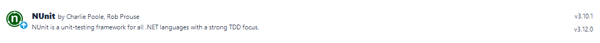
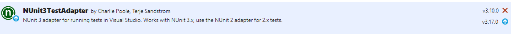
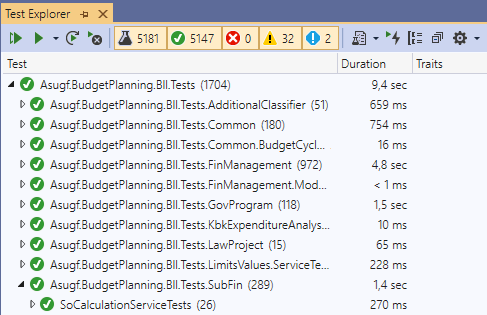

# NUnit

* * *

**Вопрос:** что нужно для того, чтобы появилась возможность добавлять в решение (solution) тесты?

**Ответ:**

1.  Необходимо добавить в проекты с тестами NuGet-пакет **NUnit**.  

2.  Использовать пространство имён **NUnit.Framework**.  

* * *

**Вопрос:** как создать класс с тестами?

**Ответ:** надо к классу добавить атрибут **`[TestFixture]`**.

**Пример:**
```csharp
[TestFixture]
public class PeriodServiceTests
```
* * *

**Вопрос:** как создать тест (тестовый метод)?

**Ответ:** надо к методу добавить один из атрибутов **`[Test]`**, **`[TestCase(...)]`** или **`[TestCaseSource(...)]`**.

**Пример:**
```csharp
[Test]
public void SetCurrentReportingStage\_NoNewReportingStage\_ThrowsException()
```
**Примечание:** описание атрибутов **`[TestCase(...)]`** и **`[TestCaseSource(...)]`** см. в разделе "Параметризованные тесты".

* * *

**Вопрос:** как временно отключить тест?

**Ответ:** надо к тесту добавить атрибут **`[Ignore]`**, который можно сопроводить поясняющим текстом.

**Пример:**
```csharp
[Ignore("Поле Comment переехало в другую сущность (OivComment)")]
[Test]
public void UpdateSoCalculationValueComments\_RepositoryNotReturnsCollection\_ReturnsNoErrors()
```

* * *

**Вопрос:** что необходимо сделать, чтобы Visual Studio могла автоматические обнаруживать тесты?

**Ответ**: добавить во все тестовые проекты NuGet-пакет **`NUnit3TestAdapter`**.



**Примечание:** автоматическое обнаружение тестов нужно для того, чтобы появилась возможность их запускать.

* * *

**Вопрос:** как запускать тесты?

**Ответ:** нужно открыть окно **`Test Explorer`** (меню **`Tests` → `TestExplorer`**). Из этого окна можно запустить все или только выбранные тесты, запустить только проваленные ("красные") тесты,  повторить последний запуск, создавать наборы тестов (плейлисты) для запуска, запускать тесты в режиме отладки (debug).



* * *

**Вопрос:** как запускать тесты прямо из кода?

**Ответ:** воспользоваться комбинацией клавиш **Ctrl-R, T**. Если курсор находится внутри тестового метода, то будет выполнен только этот тест. Если курсор находится вне какого-либо метода, но внутри тестового класса, будут выполнены все тесты из этого класса.

Так же можно воспользоваться комбинацией **Ctrl-R, Ctrl-T** для запуска теста (тестов) в режиме отладки (debug).