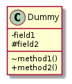
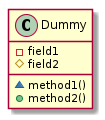
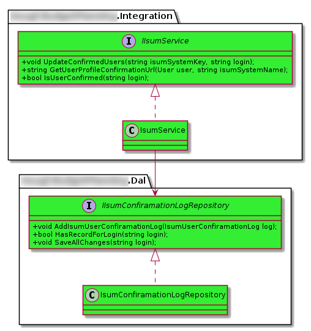
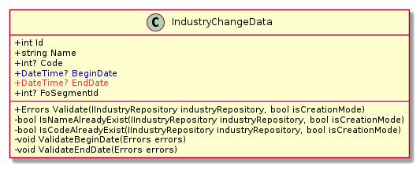
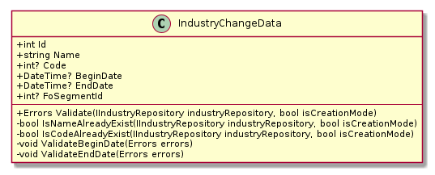
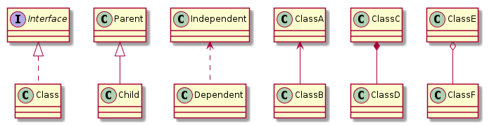
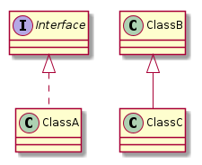

# PlantUML: диаграммы классов

**Вопрос:** какие настройки предпочтительно использовать при построении диаграммы классов?

**Ответ:** их две:

*   **`skinparam linetype ortho`** – все связи рисуются как линии, состоящие только из вертикальных и горизонтальных сегментов (т.е. нет связей, проведённых под углом к горизонту).
*   **`skinparam classAttributeIconSize 0`** – при указании видимости членов класса отменяет замену символов на значки

**Пример схемы с командой**
```
@startuml
skinparam classAttributeIconSize 0
class Dummy {
    -field1
    #field2
    ~method1()
    +method2()
}
@enduml
```

С использованием команды:




Без использования команды:
  


* * *

**Вопрос:** как задать класс?

**Ответ:**

```
class имя_класса { список_членов_класса }
```

* * *

**Вопрос:** как задать интерфейс?

**Ответ:**

```
interface имя_класса { список_членов_интерфейса }
```

* * *

**Вопрос:** как задать неймспейсы для классов/интерфейсов?

**Ответ:** есть два способа.

Первый: каждое упоминание имени класса/интерфейса квалифицировать пространством имён (в примере строки 3, 9, 12, 13, 15, 20, 23).

**Пример**
```
@startuml
skinparam classAttributeIconSize 0
interface Asugf.BudgetPlanning.Integration.IIsumService #33EE33 {
    +void UpdateConfirmedUsers(string isumSystemKey, string login);
    +string GetUserProfileConfirmationUrl(User user, string isumSystemName);
    +bool IsUserConfirmed(string login);
}

class Asugf.BudgetPlanning.Integration.IsumService #33EE33 {       
}

Asugf.BudgetPlanning.Integration.IIsumService <|.. Asugf.BudgetPlanning.Integration.IsumService

Asugf.BudgetPlanning.Integration.IsumService --> Asugf.BudgetPlanning.Dal.IIsumConfiramationLogRepository

interface Asugf.BudgetPlanning.Dal.IIsumConfiramationLogRepository #33EE33 {
    +void AddIsumUserConfiramationLog(IsumUserConfiramationLog log);
    +bool HasRecordForLogin(string login);
    +void SaveAllChanges(string login);
}

class Asugf.BudgetPlanning.Dal.IsumConfiramationLogRepository #33EE33 {       
}

Asugf.BudgetPlanning.Dal.IIsumConfiramationLogRepository <|.. Asugf.BudgetPlanning.Dal.IsumConfiramationLogRepository

@enduml
```

Второй способ: использовать конструкцию **`namespace`** (в примере строки 3, 16).

**Пример**
```
@startuml
skinparam classAttributeIconSize 0
namespace Asugf.BudgetPlanning.Integration {   
    interface IIsumService #33EE33 {
        +void UpdateConfirmedUsers(string isumSystemKey, string login);
        +string GetUserProfileConfirmationUrl(User user, string isumSystemName);
        +bool IsUserConfirmed(string login);
    }

    class IsumService #33EE33 {       
    }

    IIsumService <|.. IsumService
    IsumService --> Asugf.BudgetPlanning.Dal.IIsumConfiramationLogRepository
}

namespace Asugf.BudgetPlanning.Dal {
    interface IIsumConfiramationLogRepository #33EE33 {
        +void AddIsumUserConfiramationLog(IsumUserConfiramationLog log);
        +bool HasRecordForLogin(string login);
        +void SaveAllChanges(string login);
    }

    class IsumConfiramationLogRepository #33EE33 {       
    }

    IIsumConfiramationLogRepository <|.. IsumConfiramationLogRepository
}
@enduml
```

Примечание: имёна из "чужих" пространств имён необходимо полностью квалифицировать (см. стр. 14).

Результат в обоих случаях будет одинаковый:

  

* * *

**Вопрос:** как задать цвет классу/интерфейсу?

**Ответ:** после имени таблицы указать цвет в формате **`#RRGGBB`**.

**Пример**
```
class IsumService #33EE33 {
}
```

* * *

**Вопрос:** как указать цвет члена класса?

**Ответ:** перед именем поля указать псевдотег **`<color: цвет>`**, цвет может задаваться либо английским названиеме, либо в формате **`RRGGBB`**.

**Пример**
```
<color:blue>+DateTime? BeginDate
<color:FF3344>+DateTime? EndDate
```
  


* * *

**Вопрос:** из каких частей состоит описание класса/интерфейса?

**Ответ:** из двух – в верхней перечисляются поля и свойства, в нижней – методы.

**Пример**
```
@startuml
skinparam classAttributeIconSize 0
class IndustryChangeData {
    +int Id
    +string Name
    +int? Code
    +DateTime? BeginDate
    +DateTime? EndDate
    +int? FoSegmentId
    --
    +Errors Validate(IIndustryRepository industryRepository, bool isCreationMode)
    -bool IsNameAlreadyExist(IIndustryRepository industryRepository, bool isCreationMode)
    -bool IsCodeAlreadyExist(IIndustryRepository industryRepository, bool isCreationMode)
    -void ValidateBeginDate(Errors errors)
    -void ValidateEndDate(Errors errors)
}
@enduml
```



* * *

**Вопрос:** как задать связи между классами/интерфейсами?

**Ответ:** см. таблицу ниже.

| Название связи | Код PlantUML |
| --- | --- |
| Реализация | **`Interface <│.. Class`** |
| Наследование | **`Parent <│-- Child`** |
| Зависимость | **`Independent <.. Dependent`** |
| Ассоциация | **`ClassA <-- ClassB`** |
| Композиция | **`ClassC *-- ClassD`** |
| Агрегация | **`ClassE o-- ClassF`** |



Для наследования и реализации вместо явного описания связи можно использовать синтаксис Java/TypeScript:

**Пример**
```
@startuml
class ClassA implements Interface {
}

class ClassC extends ClassB {
}
@enduml
```
  


* * *

**Вопрос:** как должны располагаться классы относительно друг друга?

**Ответ:** лучше всего использовать естественный для архитектурных слоёв порядок: классы веб-приложения (PL, presentation layer) располагаются **над** классами бизнес-логики (BLL, business logic layer), классы бизнес-логики – **над** классами доступа к данным (DLL, data access layer).
