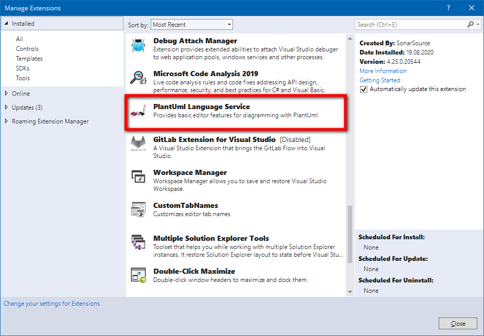

# PlantUML

* * *

**Вопрос:** что такое PlantUML?

**Ответ:** язык описания диаграмм (не только UML) плюс экосистема инструментов для рисования диаграмм по их описаниям  (например, плагины для IDE или текстовых редакторов).

* * *

**Вопрос:** какими интерпретаторами PlantUML можно воспользоваться, чтобы построить диаграмму?

**Ответ:** вариантов много, например, онлайн-редактор [http://www.plantuml.com](http://www.plantuml.com/) или [плагин для VS](https://github.com/kiebor/PlantUml-Language-Service):

* * *

**Вопрос:** какие расширения используются для файлов PlantUML?

**Ответ:** **`*.plantuml`**, **`*.puml`**, **`*.pu`**.

* * *

**Вопрос:** какую структуру имеет файл PlantUML?

**Ответ:** первая строка файла всегда **`@startuml`**, последняя – **`@enduml`**. Далее идут команды настройки диаграммы, а затем команды рисования элементов диаграммы. И настройки, и команды рисования зависят от типа диаграммы.

* * *

**Вопрос:** как в языке PlantUML задаются комментарии?

**Ответ:** однострочные – с помощью символа **'** (апостроф); многострочные начинаются парой символов **/'** (слэш + апостроф), а заканчиваются парой **'/** (апостроф + слэш).