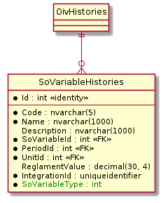

# PlantUML: ER-диаграммы (структура БД)
----------------------------------------------------------------------------------------------------

**Пример ER-диаграммы на языке PlantUML**
```
@startuml

hide circle
skinparam linetype ortho

entity SoVariableHistories {
    *Id : int <<identity>>
    --
    *Code : nvarchar(5)
    *Name : nvarchar(1000)
    Description : nvarchar(1000)
    *SoVariableId : int <<FK>>
    *PeriodId : int <<FK>>
    *UnitId : int <<FK>>
    ReglamentValue : decimal(30, 4)
    *IntegrationId : uniqueidentifier
    *<color: green>SoVariableType : int
}

OivHistories \|--o{ SoVariableHistories

@enduml |
```

**Результат:**



* * *

**Вопрос:** какие настройки предпочтительно использовать при построении ER-диаграммы?

**Ответ:** их две:

* **`hide circle`** – скрывает буквенное обозначение сущности. Т.к. на ER-диаграмме есть сущности только одного вида – таблицы, то указывать тип нет смысла.
* **`skinparam linetype ortho`** – все связи рисуются как линии, состоящие только из вертикальных и горизонтальных сегментов (т.е. нет связей, проведённых под углом к горизонту).

* * *

**Вопрос:** какова структура файла с ER-диаграммой?

**Ответ:** это не требование языка, но лучше придерживаться такой структуры: сначала перечисляются все таблицы, а в конце – все связи между таблицами.

* * *

**Вопрос:** как задать таблицу?

**Ответ:**

```
entity имя\_таблицы { список\_полей }
```

(см. стр. 6 в примере).

* * *

**Вопрос:** обязательно ли описывать таблицу с помощью инструкции **`entity`**?

**Ответ:** если не нужно указывать поля таблицы и её дополнительные свойства (например, цвет), то таблицу можно не определять. Если какое-то имя встретится только в описании связей, на диаграмме будет автоматически создана пустая таблица (см. **`OivHistories`** в примере, стр.20).

* * *

**Вопрос:** в каком порядке необходимо перечислять поля в таблице?

**Ответ:** сначала идут поля, составляющие первичный ключ (стр. 7 примера), затем остальные поля (стр. 9–17). Эти две группы отделяются друг от друга горизонтальной чертой (стр. 8).

* * *

**Вопрос:** как задать поле таблицы?

**Ответ:** в простейшем случае описание поля выглядит так:

```
имя\_поля : тип поля
```

* * *

**Вопрос:** как указать, что поле обязательно для заполнения (NOT NULL)?

**Ответ:** нужно перед именем поля поставить символ \* (стр. 7, 9, 10  и др.). На диаграмме такое поле будет помечено маленьким чёрным кругом (большой жирной точкой).

* * *

**Вопрос:** как указать дополнительные свойства поля, такие как уникальность, внешний ключ и т.д.?

**Ответ**: для этого используются так называемые **стереотипы**. Стереотип – это слово или фраза, записанная в двойных угловых скобках, при построении диаграммы они превращаются в кавычки "ёлочкой".

Для полей таблицы БД стереотипы записывают после описания поля в той же строке – см. стр. 7 (стереотип "identity"), стр. 12–14 (стереотип "FK").

* * *

**Вопрос:** как раскрасить поле таблицы в нужный цвет?

**Ответ:** перед именем поля указать псевдотег **`<color: цвет>`** – см. стр. 17 в примере.

* * *

**Вопрос:** как раскрасить таблицу в нужный цвет?

**Ответ:** после имени таблицы указать цвет в формате **`#RRGGBB`**.

**Пример**

```
entity DeputyCategory #33EE33 {
```

* * *

**Вопрос:** как указать связь между двумя таблицами?

**Ответ**: формат задания связи такой: **`левая_таблица обозначение_связи правая_таблица`** (см. стр.20 в примере).

* * *

**Вопрос:** как обозначается связь?

**Ответ:** **`мощность_связи_для_левой_таблицы--мощность_связи_для_правой_таблицы`**. См. стр. 20 в примере.

* * *

**Вопрос:** как обозначаются мощности связи?

**Ответ:**

| Мощность связи | Обозначение для левой таблицы | Обозначение для правой таблицы | Пример связи |
|:---:|:---:|:---:|:---:|
| `0..1` | `│o` | `o│` | `│o--o│` |
| `1`    | `││` | `││` | `││--││` |
| `0..N` | `}o` | `o{` | `}o--o{` |
| `1..N` | `}│` | `│{` | `}│--│{` |

Примечание 1. Символ "o" – строчная буква латинского алфавита.

Примечание 2. Правило для запоминания: "o" ("ноль") всегда внутри, "{" или "}" ("много") – всегда снаружи.

* * *

**Вопрос:** в каком порядке необходимо в связи указывать таблицы?

**Ответ:** слева должна быть таблица со стороны "один", справа – со стороны "многие". В этом случае на схеме подчинённая таблица будет изображена ниже главной (см. пример).