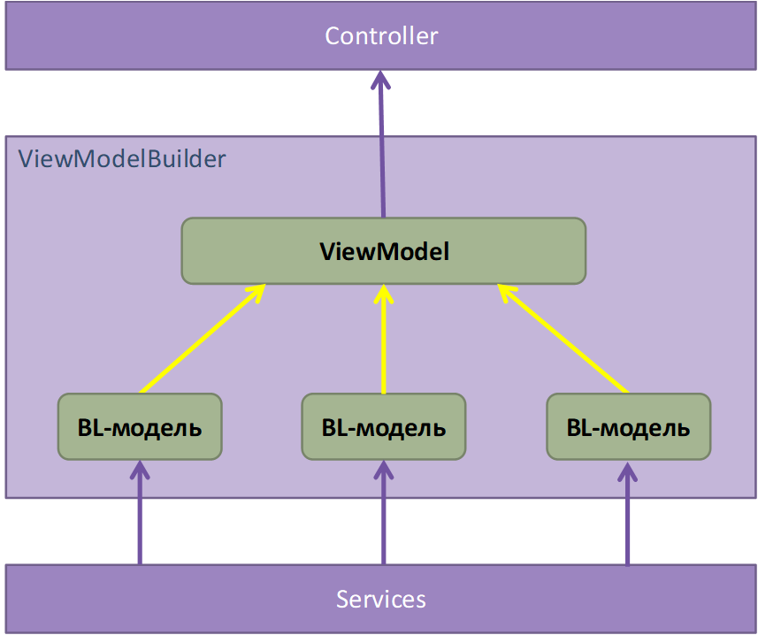

# Архитектура
---

**Примечание:** в целях анонимизации реальное название программной системы заменено на `ASys` (от `Automated System`)

### Общее описание архитектуры ASys

Система ASys имеет классическую трёхслойную архитектуру: DAL / BLL / PL. Взаимное расположение слоёв и подслоёв изображено на рис.1.

_Рисунок 1. Архитектурные слои ASys_

1. Уровень доступа к данным (Data Access Layer, DAL) располагается в проекте **ASys.Dal** и состоит из двух слоёв.

*   Нижний – Entity Framework Code First 1. Сущности EF располагаются в папке **Model**.
*   Слой репозиториев – папка **Repositories**. Репозитории предназначены для отделения бизнес-логики от логики доступа к данным. Подробнее см. раздел «Репозитории».

2. Уровень бизнес-логики (Business Logic Layer, BLL) – проект **ASys.Bll**. В системе используется анемичная модель предметной области (Anaemic Domain Model), поэтому уровень бизнес-логики состоит из классов бизнес-сущностей без поведения (папка **Models**) и доменных сервисов без состояния (папка **Services**).

3. Уровень представления (Presentation Layer, PL) содержит единственный проект **ASys.Web**, в котором реализовано веб-приложение по технологии ASP.NET MVC 2. Кроме стандартных для MVC папок (**Controllers**, **Views**, …) значимыми с точки зрения архитектуры также являются папки:

*   **ViewModels** – содержит модели представлений (view model), т.е. классы, экземпляры которых контроллеры передают представлениям («вьюхам») при их вызове.
*   **VmBuilders** – классы, предназначенные для формирования view model. На каждый контроллер приходится один билдер моделей представлений. Подробности см. в разделе «ViewModelBuilders».
*   **Queries** – классы, описывающие наборы данных, передаваемых с клиента при выполнении запросов на сервер.

4. Кроме проектов, реализующих архитектурные слои системы, имеется проект **ASys.CommonLib**, в котором содержится код общего назначения, т.е. никак не завязанный ни на предметную область (domain), ни на технические архитектурные решения (Entity Framework, ASP.NET MVC и т.д.) – см. рис.2. Этот код доступен всем архитектурным слоям системы.

_Рисунок 2. Код общего назначения_

### Репозитории

Репозитории – очень тонкий слой, отделяющий бизнес-логику от EF (абстракция вокруг ORM-фреймворка).

На каждую бизнес-сущность, и, соответственно, на каждый доменный сервис 3, создаётся один репозиторий.

Каждый метод репозитория реализует либо одну команду EF (например, ровно один “Where”), либо вызывает несколько таких методов по цепочке, т.е. является оркестратором. При изменении бизнес-требований методы репозиториев, в общем случае, не должны изменяться.

Репозитории не должны содержать какой-либо логики (кроме самой элементарной, н-р, проверки на null). Другими словами, все решения должны приниматься в бизнес-слое (в сервисах). Критерий: методы репозиториев должны быть настолько простыми, чтобы не требовать юнит-тестирования.

Если метод репозитория возвращает набор данных, то это должен быть тип **IQueryable<T>**.

### ViewModelBuilder

Классы ViewModelBuilder инкапсулируют логику по созданию моделей представлений (view model).

_Рисунок 3. Схема работы ViewModelBuilder-а._

Это очень тонкий архитектурный слой, т.е. в этих билдерах не должно быть никакой логики, только перекладывание данных из доменных моделей в модель представления.

* * *

1 Планируется переход на EF Core – после этого необходимо актуализировать описание архитектуры системы.

2 Планируется переход на ASP.NET Core MVC – после этого необходимо актуализировать описание архитектуры системы.

3 Доменный сервис может быть реализован одним или несколькими классами.