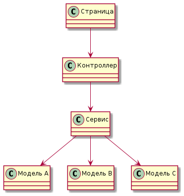

# Дизайн классов при использовании Rich Domain Model (черновик)

*   Страница системы – набор точек входа для пользовательских сценариев (user story), средство группировки пользовательских сценариев.
*   Для каждой страницы (на клиенте) создаётся контроллер, для каждого пользовательского сценария – экшен контроллера. Страница может обращаться за необходимыми данными к "чужим" контроллерам.
*   Для каждого контроллера создаётся сервис, для каждого пользовательского сценария – публичный метод сервиса.
*   Сервис может при своей работе обращаться к любому количеству доменных сущностей (BLL-моделей).
*   Вся бизнес-логика сконцентрирована в сервисах и доменных сущностях, при этом бизнес-логика по максимуму размещается в сущностях. Т.е. если какая-то логика может быть размещена в доменной сущности – она должна быть размещена в там. В сервисах остаётся только то, что в сущностях реализовано быть не может.
*   (? пока обсуждается) Классы доменных сущностей не могут иметь внешних зависимостей.

  
