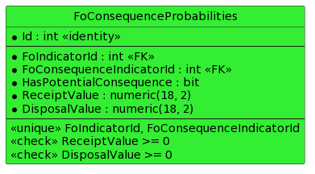
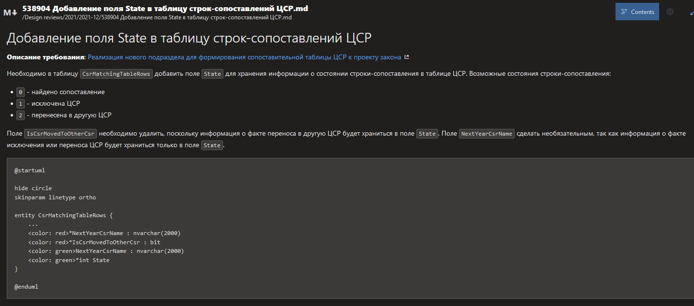

# Регламент проведения этапа проектирования ПО (software design phase)

**Терминология документа**

Предложение – предложение по изменению дизайна классов и/или структуры БД.

**Положение о проведении этапа проектирования дизайна классов и структуры БД**

1. **Условия возникновения этапа проектирования**. Если в процессе работы над задачей выясняется, что необходимо создавать новые классы, перемещать модули между папками/проектами или изменять структуру БД, разработчик должен инициировать фазу проектирования (software design phase) до того, как приступит к кодированию.  
Список случаев-исключений, которые не ведут к старту фазы проектирования:
* Создание нового представления MVC (View)
* Создание нового класса DTO, например, модели представления MVC (view model)
* Создание сущности Entity Framework (класса, представляющего таблицу БД)
* Изменение в БД дополнительных свойств типа поля, таких как длина для строк или точность для чисел.
* Разделение сервиса на несколько путём дробления его ответственности: persistence, validation, statuses, notifications, export, import и т.д.

2. **Форма проведения этапа проектирования.** Фаза проектирования проходит в формате дизайн-ревью. Исполнитель задачи должен разработать предложение и оформить его в виде пулл-реквеста (подобно code review). Требования к пулл-реквесту – как к форме, так и к содержанию – описаны далее.

3. **Рецензенты.** Обязательными рецензентами на дизайн-ревью являются:
   1. Овнер и дублёр данного функционального блока  (список овнеров и дублёров прилагается).
   2. "Свободные" рецензенты, назначаемые овнером. При назначении необходимо руководствоваться принципом равномерности нагрузки.
   3. Суммарное количество обязательных рецензентов должно быть не менее трёх.
   4. Так же в обсуждении проекта могут по собственной инициативе принять участие любые другие члены команды без ограничений.

4. **Workflow и сроки проведения дизайн-ревью**
   1. Автор проекта дизайна оповещает в канале Teams `Developers.DesignReview` о появлении пулл-реквеста дизайн-ревью. Если автор является одновременно овнером, он сразу упоминает дублёра и двух фрименов (см. п. 3). В противном случае автор должен упомянуть овнера, чтобы тот мог приступить к формированию списка рецензентов в соответствии с п.3.  
Овнер в этом же канале размещает с поимённым упоминанием список рецензентов, которые обязаны сообщить в канале о прочтении оповещения.
   2. Рецензенты обязаны приступить к анализу предложения максимально оперативно.
   3. Также максимально быстро должна проходить вся работа по рассмотрению предложения (т.е. обработка комментариев, ответов на них и т.д.). Если ни автор предложения, ни рецензенты не являются удалёнными сотрудниками, допускается перенесение обсуждения в оффлайн (маркерная доска, бумага и т.д.). При этом окончательный вариант в любом случае должен быть отражён в дизайн-ревью.
   4. Максимальный срок рассмотрения предложения (прохождения всех этапов работы над ним) -- сутки. В случае истечения максимального срока рассмотрения предложения автоматически считается принятым текущий его вариант. Автор предложения должен оповестить в канале о принудительном завершении фазы проектирования.

5. **Обязанности рецензентов**
   1. Рецензенты обязаны при рассмотрении проекта дизайна изучить постановку задачи.

6. **Требования к пулл-реквесту, содержащему предложение**
   1. Для пулл-реквеста дизайн-ревью создаётся отдельная папка в проекте `**Design reviews**`. Имя папки должно содержать номер WI и очень краткое описание предложения.
   2. Заголовок пулл-реквеста должен кратко описывать содержание предложения.
   3. Пояснительная записка к предложению должна включаться в пулл-реквест как файл формата Markdown `Description.md.`
   4. В пулл-реквест может добавляться любое необходимое количество файлов с примерами кода или с диаграммами в формате PlantUML.  
   Для описания предлагаемой структуры БД используется максимально детализированная ER-диаграмма (диаграмма "сущность-связь").  
   Для описания предлагаемого дизайна классов применяются, в первую очередь, диаграммы классов (они являются обязательными), но так же могут использоваться диаграммы последовательности, диаграммы объектов, диаграммы состояний и любые другие, которые автор предложения посчитает нужными.  
   Если рецензент посчитает необходимым включение в предложение по дизайну классов диаграмм последовательности, то автор должен доработать предложение и включить в него эти диаграммы.
   5. Вместо папки с набором файлов может быть использован один файл формата Markdown, включающий как текстовое описание, так и код диаграмм. Имя файла должно содержать номер WI и очень краткое описание предложения. Пример такого файла приведён в приложении.
   6.  В начале файла `Description.md` должна быть размещена ссылка на страницу в Confluence с постановкой задачи.
   7.  В пулл-реквест с реализацией предложения необходимо добавлять ссылку на пулл-реквест с предложением (т.е. на пулл-реквест дизайн-ревью).

7. **Общие требования к предложению**
   1. Для каждого изменения в дизайне должна быть указана причина. Если причиной является изменение требований, то эти изменения требований должны быть отражены в постановке задачи.
   2. Для каждого нового/изменившегося имени должен быть указан перевод на русский язык.
   3. В случае, если кроме появления новых классов/таблиц БД изменились существующие, необходимо описать как ситуацию "до", так и "после".
   4. Все сокращения, кроме общепринятых, необходимо расшифровывать.
   5. Для удобства восприятия информации на диаграммах необходимо использовать цветовую индикацию статуса классов/таблиц БД – удаляемые изображать с красным фоном, новые – с зелёным, остальные – с фоном по умолчанию (жёлтый).

8. **Требования к проекту дизайна классов**
   1. Для каждого нового/изменившегося класса необходимо описывать его ответственность.
   2. Для каждого нового/изменившегося класса необходимо указать его поля/свойста и сигнатуры его методов.
   3. При проектировании дизайна классов обязательно следование принципам SOLID.
   4. Всячески приветствуется использование уместных в данной ситуации паттернов проектирования.

9. **Требования к структуре БД**
   1. Структура БД должна соответствовать 3НФ.
   2. Для новой/изменившейся таблицы необходимо указывать на схеме все связанные таблицы; исключение – тривиальные случаи. Список тривиальных случаев:
      * Переименование поля / таблицы
      * Изменение типа поля
      * Добавление индексов
      * Добавление ограничения уникальности
   3. Также для новой/изменившейся таблицы необходимо указать все ограничения (constraints). Они перечисляются в третьей (самой нижней) секции таблицы с указанием соответствующего стереотипа (см. пример).

**Пример.** Указание ограничений таблицы.



**Приложение:** пример markdown-файла предложения для design review.

Имя файла: `538904 Добавление поля State в таблицу строк-сопоставлений ЦСР.md`

````
# Добавление поля State в таблицу строк-сопоставлений ЦСР

**Описание требования**: [Реализация нового подраздела для формирования сопоставительной таблицы ЦСР к проекту закона](https://conf.company.ru/pages/viewpage.action?pageId=138085270)

Необходимо в таблицу `CsrMatchingTableRows` добавить поле `State` для хранения информации о состоянии строки-сопоставления в таблице ЦСР.

Возможные состояния строки-сопоставления:

- `0` - найдено сопоставление
- `1` - исключена ЦСР
- `2` - перенесена в другую ЦСР

Поле `IsCsrMovedToOtherCsr` необходимо удалить, поскольку информация о факте переноса в другую ЦСР будет храниться в поле `State`.  
Поле `NextYearCsrName` сделать необязательным, так как информация о факте исключения или переноса ЦСР будет храниться только в поле `State`.

```
@startuml
hide circle
skinparam linetype ortho
entity CsrMatchingTableRows {
    ...
    <color: red>*NextYearCsrName : nvarchar(2000)
    <color: red>*IsCsrMovedToOtherCsr : bit
    <color: green>NextYearCsrName : nvarchar(2000)
    <color: green>*int State
}
@enduml
```
````

Результат:

