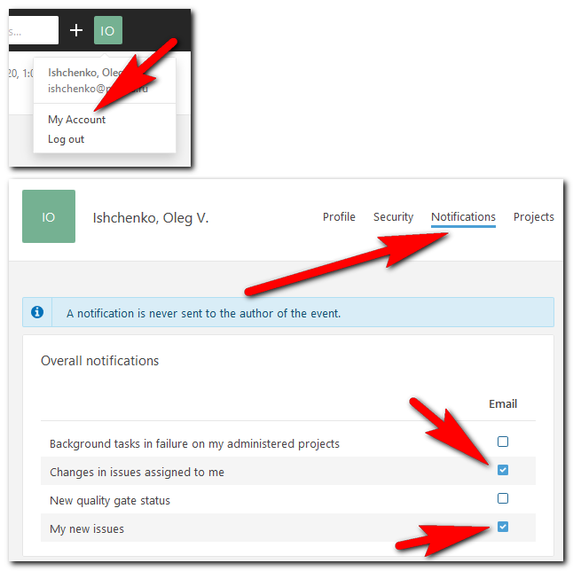
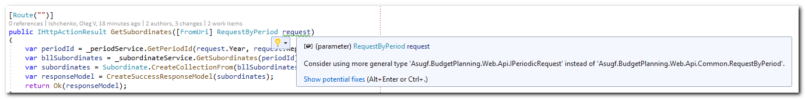

# SonarQube: порядок работы с выявленными проблемами (issues)

## 1. Общие положения

1. Для получения оповещений о новых issues необходимо на них подписаться.  
Для этого нужно перейти на страницу своего аккаунта SonarQube и в разделе "**Notifications**" включить оповещения для событий "**Changes in issues assigned to me**" и "**My new issues**":  

2. Если оповещения включены, после каждой проверки SonarQube на почту будет приходить письмо со ссылкой на список выявленных новых issues. В этом списке будут только те issues, которые появились после предпоследней проверки.
3. Разработчик должен исправить все выявленные SonarQube проблемы (есть исключения, см. раздел "Исключения для конкретных правил статического анализа"). Трудозатраты по этим исправлениям заносятся в те WI, в рамках работы над которыми были созданы issues. Если исправление issue невозможно ассоциировать ни с одним из текущих WI, то его необходимо производить в рамках специального WI "Рефакторинг подсистем (исправление Issue SonarQube)".
4. Если при работе над issues возникают вопросы, их необходимо задавать в канале "SonarQube" (_адрес канала_), упоминая мастера по SQ (конкретные персоналии см. в Приложении) и техлида. Если issue связан с технологиями frontend-а, также необходимо упомянуть ведущего фронтендера.
5. Разработчики _не могут_ самостоятельно изменять статусы ишью или переназначать их на других разработчиков. Все подобные вопросы должны решаться в канале "SonarQube".
6. Еженедельно (по понедельникам) подводится итог по всем разработчикам по тем issues, которые появились за этот срок и не были исправлены. Полученная информацию будет использоваться руководством группы при принятии управленческих решений.
7. Крайне рекомендуется использовать дополнение для Visual Studio под названием "**SonarLint**". Это позволит получать информацию о имеющихся/появившихся issues не на следующий день после заливки кода в ветку **develop**, а сразу по ходу работы.

## 2. Исключения для конкретных правил статического анализа

Ниже перечислены исключения для правил статического анализа. В случае наличия такого issue исправлять его не нужно – необходимо сообщить о нём в канале SQ со ссылкой на issue и номером исключения. Эти issue будут переводится в статус "Won't fix" мастером SQ или ведущим фронтендером.

**Предостережение для редакторов:** менять номера правил нельзя, т.к. они указываются в комментариях к закрываемым ишью.

1. Правило: слишком длинные строки кода. Исключение: в строке находится длинный строковый литерал.
2. Правило: замена типа параметра метода на более общий. Исключение: замена `IDictionary` на `IEnumerable<KeyValuePair<TKey, TValue>>`.
3. Правило: замена конкретного типа параметра метода на интерфейс. Исключение: ситуации, когда вызов метода осуществляется каким-либо фреймворком (н-р, ASP.NET) и объект-параметр инстанцируется автоматически. В этом случае интерфейс использоваться не может, нужен конкретный класс.  
Пример: параметр метода-action контроллера MVC/WebAPI. Объекты, передаваемые в метод-action, создаются инфраструктурным кодом автоматически, поэтому в данной ситуации должен обязательно использоваться конкретный класс.  

4. Правило: магические константы. Исключение: именованный параметр метода магической константой не является. Пример: `...Substring(startIndex: 0, length: 2)`.
5. Правило: замена типа параметра метода на более общий. Исключение: в методах `Map`, преобразующих `IQueryable<DAL.тип>` в `IEnumerable<BLL.тип>`, замена `IQueryable` на `IEnumerable`.
6. Правило: магические константы. Исключение: коэффициенты в математических формулах магическими константами не являются.
7. Правило: слишком большое число параметров конструктора/метода. Исключения: (1) конструкторы моделей –  DAL-моделей, доменных моделей, моделей представления (н-р, WEB-моделей, моделей отчётов и т.д.), т.к. количество свойств модели (и, соответственно, количество параметров конструктора) может диктоваться требованиями, н-р, предметной областью; (2) методы `SetProperties` – по той же причине.

Также являются не обязательными для немедленного взятия в работу issue про исправление TODO , т.к. с помощью этого тега помечается техдолг, который будет возвращаться когда-нибудь в будущем. При еженедельном подведении итогов такие issue учитываться не будут, в канал о них сообщать не нужно.

**Приложение**. Список рабочей группы по SonarQube:

*   мастер SonarQube: Иван Иванов
*   техлид команды: Пётр Петров
*   ведущий фронтендер: Сидор Сидоров